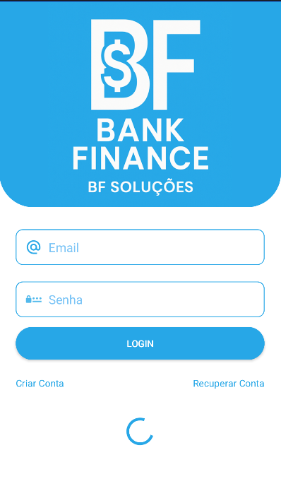
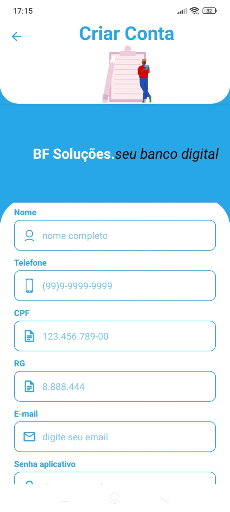
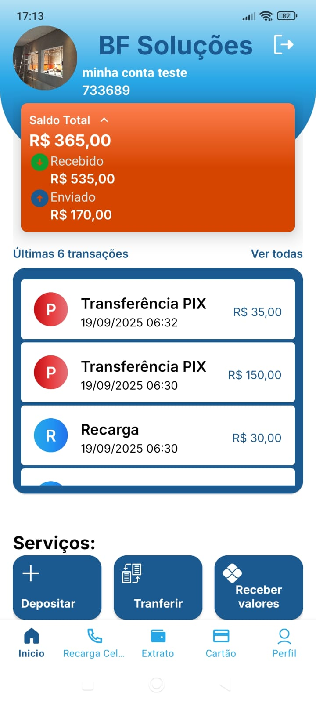
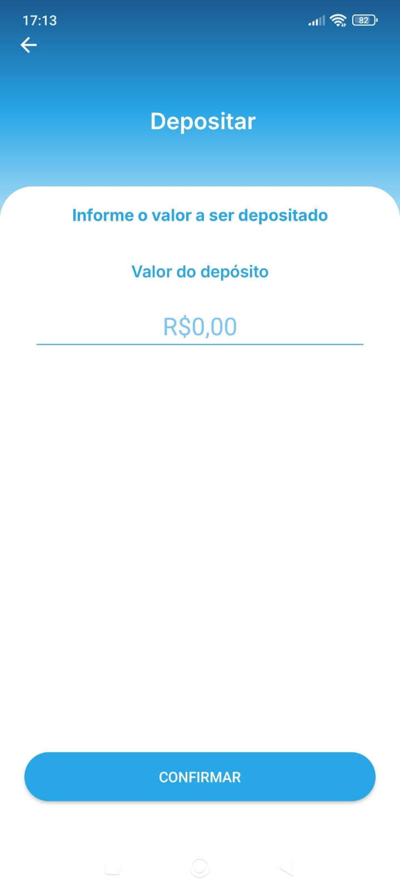
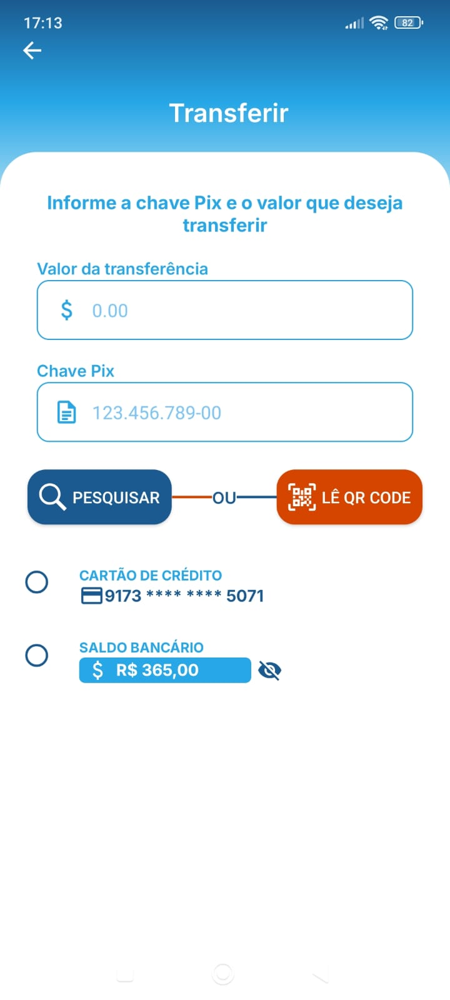
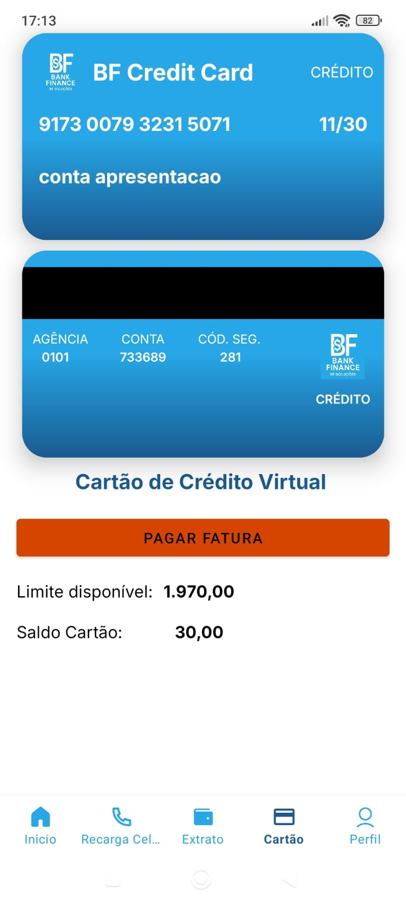
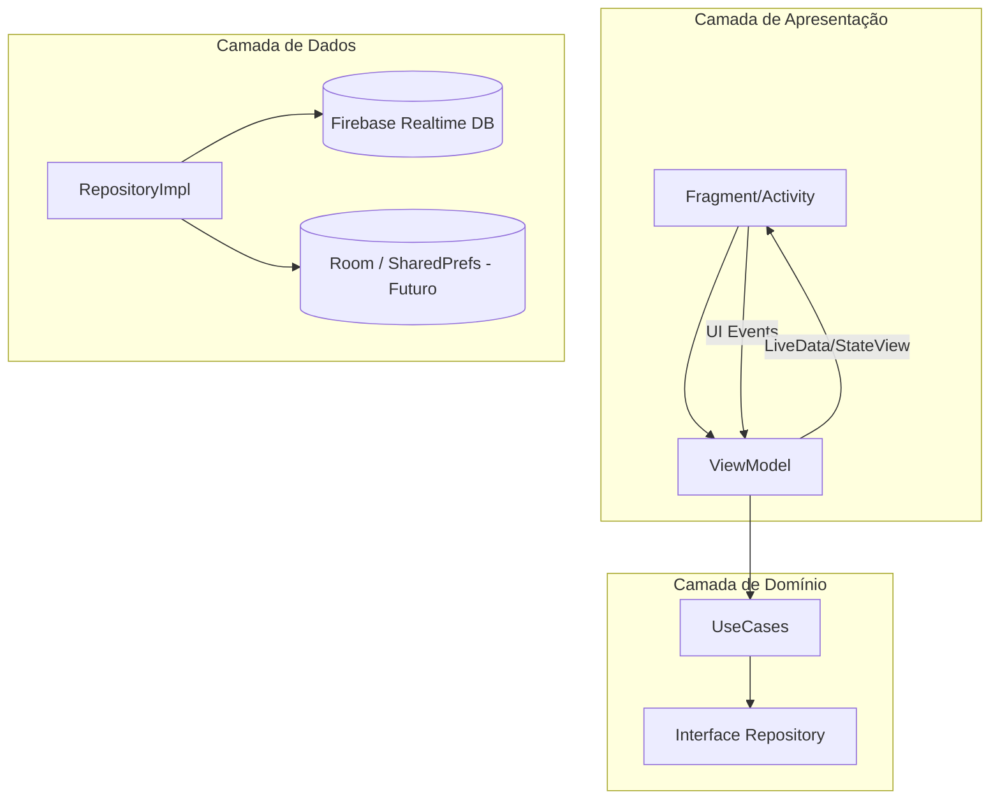

# 💰 BankFinance - Aplicativo de Gestão Financeira

O **BankFinance** é um aplicativo mobile desenvolvido em **Kotlin + Android**, que simula operações financeiras em um banco digital.  
O app foi construído com foco em **aprendizado**, **boas práticas de arquitetura (Clean Architecture + MVVM)** e **uso de Firebase** como backend.

---

## 🚀 Funcionalidades Principais

- 📲 **Autenticação de Usuários**
    - Login, Registro e Recuperação de Conta.
    - Armazenamento seguro de dados no Firebase.

- 💵 **Depósitos**
    - Realize depósitos na sua conta e acompanhe os comprovantes.

- 📱 **Recargas**
    - Recarregue celulares com saldo ou cartão de crédito.
    - Recibo gerado automaticamente após cada operação.

- 🔄 **Transferências via PIX**
    - Envie e receba transferências instantâneas via chave PIX.
    - Fluxo com validação de senha de transação.
    - Geração automática de **recibo detalhado**.

- 🧾 **Extrato de Transações**
    - Visualize todas as movimentações financeiras (depósitos, recargas, transferências).
    - Filtros por tipo de operação.

- 💳 **Cartão de Crédito**
    - Consulta de limite disponível.
    - Uso como método de pagamento alternativo.

- 👤 **Perfil do Usuário**
    - Visualização e edição de informações básicas.

---

## 🏗️ Arquitetura e Tecnologias

- **Kotlin** como linguagem principal.
- **Clean Architecture + MVVM** para separação de camadas.
- **Firebase Realtime Database** para persistência em nuvem.
- **Hilt (Dependency Injection)** para injeção de dependência.
- **Coroutines + LiveData** para programação assíncrona e reativa.
- **Navigation Component** para navegação entre telas.
- **Material Design** para UI moderna e responsiva.

---

## 📸 Telas do Aplicativo


- Tela de Splash
  

- Tela de Login  
  

- Tela de Criação de conta 
  

- Tela de Home  
  

- Recibo
  

- Deposito
  

- Transferencia
  

- Cartão de Crédito
  

- Perfil
  
---

## 📦 Instalação

### 🔧 Pré-requisitos
- Android Studio (versão recomendada: **Giraffe ou superior**).
- SDK Android 24+.
- Conta Firebase configurada.

### ▶️ Rodando o projeto localmente

```bash
# Clone este repositório
git clone git@github.com:aironsg/Bank-Finance-App.git

# Abra o projeto no Android Studio
# Configure seu arquivo google-services.json com sua conta Firebase

# Rode o app no emulador ou dispositivo físico
```


## 📐 Diagrama de Arquitetura


📥 Download do APK

A versão mais recente pode ser baixada aqui:
👉 Download APK : https://drive.google.com/file/d/1utw_tm5P072HXbV1prg5asjU9ZMP-MJu/view?usp=sharing

🧪 Testes

Testes unitários implementados para fluxos principais (ex.: Transferências PIX).

Camada de repositório e useCases isolados para testes independentes.

📖 Próximos Passos

Implementar notificações push para novas transferências(feito, mas não ativado).

Melhorar relatórios financeiros (gráficos de receitas/despesas).

Publicar na Play Store.

👨‍💻 Autores

Desenvolvido por [Airon silva](https://www.linkedin.com/in/airon-silva-dev/).
📧 Contato: airon_gm@hotmail.com

🔗 LinkedIn: https://www.linkedin.com/in/airon-silva-dev/

📜 Licença

...


---


